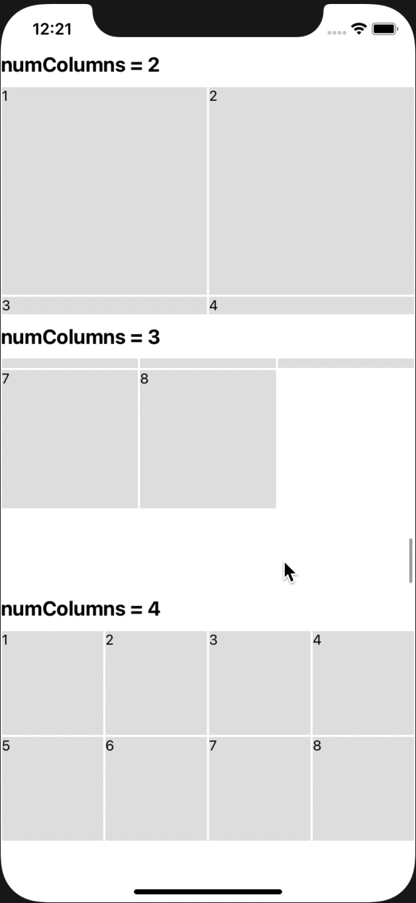

# React native Flat List Grid

<p align="center">
  
</p>


## Quickstart

    yarn add react-native-flat-grid

## Using

```JS
import FlatGridList from 'react-native-flat-grid';

const LIST = [
  { id: 1 },
  { id: 2 },
  { id: 3 },
  { id: 4 },
  { id: 5 },
  { id: 6 },
  { id: 7 },
  { id: 8 }
];

<FlatGridList
  data={LIST}
  numColumns={2}
  renderItem={({ item, index }, itemStyle) => {
    return (
      <View style={itemStyle}>
        <Text>{item.id}</Text>
      </View>
    )
  }}
/>
```
